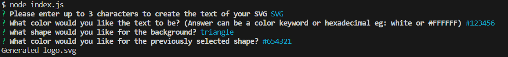

# SVG Generator
## Description
This application provides a user with a series of prompts to allow them to generate a logo as an SVG file. Users are prompted to provide text, select a shape, and input colors for both fields. The generated SVG is then saved and available to be used.
## Table of Contents

- [Description](#description)
- [Installation](#installation)
- [Usage](#usage)
- [Questions](#questions)
## Installation
The application can be downloaded through GitHub. Once downloaded, the user must make sure to install the requisite dependencies using the following command in their preferred CLI.
    
    npm i

Then the app can be run by entering the following in the CLI:

    node index.js

## Usage
The application is meant to provide a user with the ability to quickly and easily generate a simple logo without the need to hire a graphic designer.

## Tests
The application comes with a simple test suite that can be run using the following command. (Please ensure that all dependencies have already been installed.)
    
    npm test

## Questions
For any questions you can reach out to me at:

My Email: [ziad.t.alfadl@gmail.com](mailto:ziad.t.alfadl@gmail.com)

My GitHub: [https://github.com/Z-Alfadl](https://github.com/Z-Alfadl)
